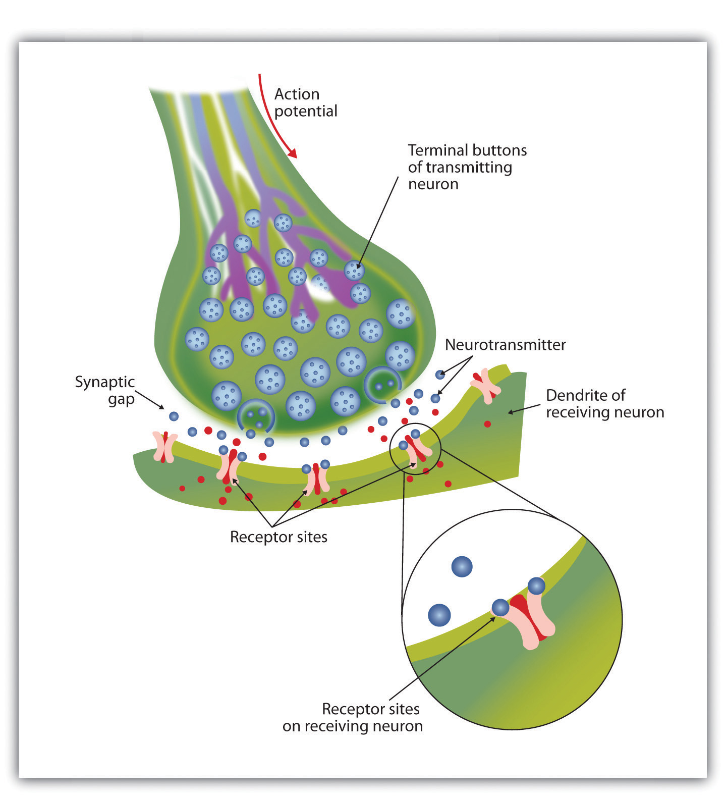
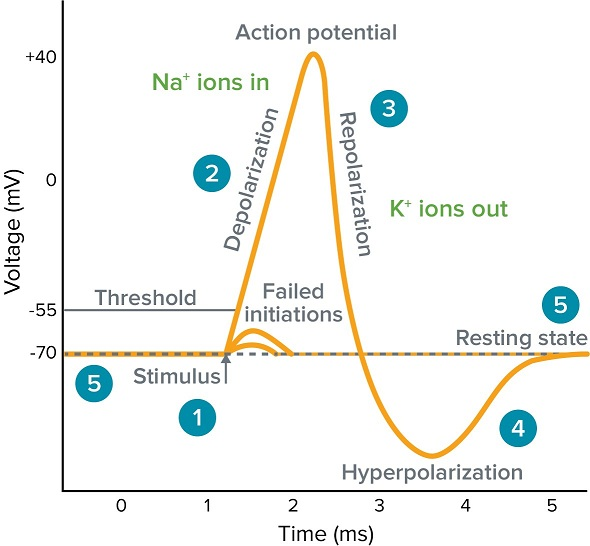

Introduction
============

.. toctree::
   :maxdepth: 2

The human body has always been an inspiration for many technologies. Scientists have
successfully achieved to understand the mechanics behind different parts of the human
body and have created models that imitate the functionalities of the studied parts. The
human brain is one of the most complex organs in the human body (Nolte, 2002), and
we do still not fully understand its inner workings. Creating machines that can achieve
human capabilities such as high-level cognition associated with conscious perception is
a human dream since a long time. However, before such a goal can even remotely be
achieved, we need to understand how information is processed in the brain, how that
would be replicated by machines, and how models of it can be created that target specific
functions of the brain and replicate their behavior in connection with other parts of the
body.
Due to technical and ethical reasons, neuroscientist may not be able to directly investigate
certain parts of the brain and experiment on their responses. Therefore, to avoid experi-
menting in vivo and at the same time attaining realistic results, an embodied simulation
framework like presented in Feldotto et al. (2022) might be used to simulate the brain at
scale in order to capture the contributions of multiple brain regions involved in purposeful
actions.
Successfully understanding the processes in the brain that create phenomena such as cre-
ativity, dreaming and consciousness crucially depends on efficient and easy to use neural
simulators, the development of which strongly depends on the interaction between re-
searches from both the fields of computer science and neuroscience. Such interactions may
lead to better quality and feature-richness of the simulation frameworks and as a result to
a better understanding of the human mind. One building block in the neural simulation
landscape are tools for the creation of neuron and synapse models, which are the basic
processing elements of the brain

The structural and functional unit of the neural system
#######################################################

The nervous system consists mainly of two types of cells: neuron and glia. The neurons
are information messengers that use electrical impulses and chemical signals to transmit
information between different areas of the brain and between the brain and the rest of
the nervous system. Everything we think, feel and do would be impossible without the
1work of neurons. Glial cells provide support for neurons in the form of nutrients and other
chemicals and play an important role in keeping the chemical environment of the brain in
a good working condition, for example by taking up left-over neurotransmitters or surplus
ions.

.. _fig-neuron:

.. figure:: ../resources/images/fig/Components_of_neuron.jpg
   :alt: The neuron

   The neuron [1]_: Neurons consist of three major components: The cell body (also known as the soma) is the core of the neuron containing the nucleus of the cell. The dendrites are a tree-like, branched structure collecting information from other cells and sending it to the soma. The axon is a long
   segmented protrusion transmitting information away from the cell body towards other
   connected neurons. Moreover, the axon is surrounded by a layer of fatty tissue known as
   the myelin sheath. It acts as an insulator and allows faster transmission of the electrical
   signal by preventing the electrical charge from shorting out.

The whole process of communication between neurons as depicted in Figure 1 is based
on passing an electrochemical signal from one neuron (called the pre-synaptic neuron) to
many neurons (called post-synaptic neurons). A received electrical impulse travels through
the neuron and a chemical reaction is triggered to transmit the signal to the next neuron.
When a signal is received at the level of the dendrites, it is transmitted to the soma in
the form of an electrical signal. If the accumulated signal is strong enough, it may be
forwarded to the axon and afterwards to the synapses. Reaching these terminal stations,
a chemical reaction takes place, emitting neurotransmitters, which are transported to
connected neurons across the space between the cells. See Figure 2 for details.

.. _fig-synapse:

   The synapse [2]_: Most communication between neurons occurs at specialized structures called synapses. The synapse is the area where two neurons come close enough that they are able to pass a chemical signal (neurotransmitters) from one to another. The gap between the neurons where this chemical exchange takes place is called the synaptic cleft. Neurotransmitters are packaged into small sacs called vesicles (blue circles in the figure). Each vesicle can contain thousands of neurotransmitter molecules. When the pre-synaptic neuron gets active, this causes the vesicles to fuse with the pre-synaptic membrane and release the neurotransmitter molecules into the cleft. Once the neurotransmitter are in the synaptic cleft, they interact with the receptors on the post-synaptic membrane, bind with them, and may cause an action to occur in the post-synaptic cell.

We distinguish three states (or phases) that a neuron can undergo, the resting state, the
action potential and the hyper-polarization as depicted in Figure 3. In the resting state,
the interior of the cell contains a greater number of negatively charged ions than the
outside of the cell. This imbalance leads to a measurable membrane potential of about
-55 mV. If the first segment of the axon is stimulated by an incoming signal traveling down from the dendrites and if the impulse is strong enough to reach a certain threshold,
the segment opens its voltage-gated ion-channels, allowing positively charged sodium ions
(Na+) to enter. This change in electrical charge is known as an action potential or spike due to the form of the excursion of the membrane potential. Once an action potential
is elicited, the number of positively charged ions exceeds the number of negative ions in
the segment, and it becomes temporarily positively charged. As a consequence, a similar
electrical change occurs in the next segment, allowing the electrical impulse to travel along
the axon as a wave until it reaches the synapses. It is important to note here that when
the signal passes the next segment, the prior segment’s gates close again and the potential
returns to its original state.

.. _fig-action:

   The Action potential [3]_: (1): Stimulus triggers the rapid change in voltage or action potential. A sufficient current must be accumulated in the cell in order to raise the voltage above the threshold voltage to start membrane depolarization. (2): Depolarization is depicted as the rising phase, and it occurs when the sodium channels in the cellular membrane open causing a large influx of sodium ions. (3): Membrane Repolarization results from rapid sodium channel inactivation as well as a large efflux of potassium ions resulting from activated potassium channels. (4): Hyperpolarization is a lowered membrane potential caused by the efflux of potassium ions and closing of the potassium channels. (5): Resting state is when membrane potential returns to its resting voltage before being stimulated.

An important property of the action potential is that it cannot be partial. It is that the
neuron either fires completely, such that the action potential travels all the way down the axon, or it does not fire at all. After firing a spike, the neuron is not able to instantly fire again due to the depletion of its neurotransmitter vesicles. This is true even if other electrical impulses are being accumulated at the dendrites. This period of hyper-polarization is also called the refractory period of the neuron.

When an axonal action potential reaches the terminal stations, the electrical impulse
signals them to release neurotransmitters into the synapse. These neurotransmitters travel
across the synaptic space between the terminal stations of one neuron and the dendrites
of the others, where they bind to specific receptors on the dendrites of the post-synaptic
neuron. Neurons may have the property of either having an excitatory or inhibitory effect
to their post-synaptic neurons. Neurotransmitters exhibiting an excitatory increase the
neuron’s likelihood to fire, while inhibitory neurotransmitters decrease the cell’s likelihood
to fire. Given that different neurotransmitters arrive at the dendrites, the neuron will
be influenced by both excitatory and inhibitory signals. The neuron accumulates both
types of signals and when the total effect of the excitatory signals are greater than the
total effect of the inhibitory signals, the neuron moves closer to its signal transduction
threshold. Reaching the threshold, the signal is transmitted via the dendrite and the
process begins anew in the next cell.

Gaining new knowledge, the connection between neurons strengthen. This is called long-
term potentiation (LTP ) and it is an example of synaptic plasticity. It underlies the process
of learning and memory retention. New memories are formed when neurons establish new
connections, or strengthen the existing synapses.

Neuronal simulation
###################

A cubic millimeter of mouse cortex contains about 9 × 10 4 neurons, 7 × 10 8 synapses [4]_. This tremendous number of neurons and connections makes it hard to conquer the overall complexity of the brain. Computer simulations can be a helping tool, but they have to be very efficient in simulating the targeted parts and representing the available resources.

A neural simulator is a piece of software that would allow the user to specify models at a
high level language by specifying the behavior of the models in a standard mathematical
notation. The simulators should implement a computationally efficient algorithms and
support a large-scale modelling and complex biophysical models. In order to minimize
the learning and development time, the simulators should come with an extra component
that transforms the user written model in the high level language into a low level language
such as C++. An advantage of such component is that the user won’t require an expertise
in programming nor the knowledge of neural simulation algorithm. Additionally, the
generated low level code can be targeted to any chosen hardware configuration without
the need of adjusting the original code that was written in the high level language and
thus the model can be at the same time optimized for CPU as well for running optimally
in a specific GPU environment. Both, the neural simulator NEST [5]_ and Brian [6]_ handles the connectivity of the neuron in the brain as a Graph G with the neurons being the set of nodes
building the ensemble V and the synapse as the connections between the nodes building
the ensemble E. Each of the neurons and synapses in both simulators may have different
properties that replicate their biological properties, and they can be set before running
the simulation.

The neural simulation tool NEST (Gewaltig & Diesmann, 2007; Spreizer et al., 2022) is
capable of simulating large neuronal networks with different neuron and synapse models.
NEST is written in C++ and employs OpenMP for in-node parallelization using threads
and the message passing-interface MPI (Clarke et al., 1994) for distributed simulations.
Its Python interface (PyNEST ; Eppler et al., 2009) makes it easy for users to run the
simulations. Neuron models may be anything from simple point neurons like the integrate-
and-fire neuron to complex compartmental neurons. While synapses may either be static
or have a variant weight that changes over time according to a plasticity algorithm. NEST
supports a variety of algorithms for synaptic plasticity. Examples for such algorithms are
spike-timing-dependent plasticity (STDP), short-term plasticity (STP), or third-factor
neuromodulated weight dynamics.

The neural network in NEST is generated from neurons and their connections using
high-level API functions in PyNEST. The most essential functions are Create(),
which is responsible for creating instances of the desired neuron models, Connect(),
which connects the neurons and shapes the topology of the neural network, and
Simulate(), which drives the state of the dynamic system in time. The type of the
synapse model used between the pre-synaptic neuron and the post-synaptic neuron
is defined in the Connect() function. Listing 1 shows a simple example of how to
create two neurons and connect them using a specific synapse type and run the simulation.

.. code-block:: python
	:caption: simple_script
	:name: simple_script
	:linenos:

	import nest

	# Create neurons and devices
	neurons = nest.Create('hh_psc_alpha_gap', 2)
	neurons.I_e = 100.0
	neurons[0].V_m = -10.0

	vm = nest.Create('voltmeter', params={'interval': 0.1})

	# Connect neurons and devices
	nest.Connect(neurons, neurons,
    			{'rule': 'all_to_all', 'allow_autapses': False},
    			{'synapse_model': 'gap_junction', 'weight': 0.5})

	nest.Connect(vm, neurons, 'all_to_all')

	# Simulate the neural network
	nest.Simulate(10.0)

As depicted in :numref:`simple_script`, every simulation script using PyNEST starts with importing the nest
module in Python. In line 4, we create two Hodgkin-Huxley neurons as instances of the
hh psc alpha gap model. In line 5, we set a background current of 100.0 pA for both
neurons. Line 6 modifies the initial membrane potentials of the first neuron instance to be
at -10.0 mV. In line 8, we create a voltmeter to record the membrane potential of both
neurons. In line 11, we connect the first neuron with the second neuron, and vice-versa
using the gap junction synapse model. Finally, we connect the voltmeter to the neurons to
record their membrane potential over the course of the simulation in line 15 and run the
simulation for 10.0 milliseconds in the last line by calling the Simulate() function.

Being a research tool, NEST is constantly applied to new use cases and the set of built-in
neuron and synapse models is by definition never complete. In order to not restrict users
to only the models that come with NEST, they can create custom neuron and synapse
models with the NEST Modelling Language NESTML [7]_.

NESTML allows users to express models by specifying their state variables,
parameters, equations, and optionally a procedural description of how the state is to be
updated during the simulation. Such models can then be used in simulation studies by
loading the generated and complied model libraries at runtime into NEST. NESTML itself
is written in Python and consists of two parts: The first is a language specification that
is heavily based on the syntax of Python, but also provides domain concepts like physical
units and differential equation as first class concepts. Each custom model in NESTML is
defined by its name in the neuron block of the language and the specified name is used for
generating the library code in C++ and for using the model in the simulation script. The
second part of NESTML is a tool chain that takes a model description and produces C++
code and the boilerplate code required to compile the model into a dynamically loadable
library. The most important function in the Python interface to NESTML (PyNESTML)
is the function generate nest target(), which generates an extension module for
NEST given one or more .nestml files. After installing the library, instances of the
model can be created using PyNEST’s Create() function and connected with other
elements in the network using the Connect() function.

.. code-block:: python
	:caption: generate_lib
	:name: generate_lib
	:linenos:

	# Generate code only for a neuron model
	generate_nest_target(
    		input_path="neuron_model.nestml",
    		target_path="where_to_generate_the_code",
    		module_name="simple_module",
    		logging_level="ERROR")

	# Install the extension module
	nest.Install("simple_module")

	# Create instances of the model
	neuron = nest.Create("neuron_model", 2)

	# Create a simple network
	nest.Connect(neurons[0], neurons[1],
    		syn_spec={'synapse_model': "any_built_in_synapse_type"})

As depicted in :numref:`generate_lib`, the generate nest target function
generates code only for a neuron model. The minimum required parameter of the function
is the input path that points to the location of the model. Once the code is generated,
the built libraries can be loaded into NEST using the Install function by providing the
name of the module (simple module). Once the model is installed in NEST, we can create
instances of the model by calling the Create() function with the model name being the
name that was written in the NESTML file in the neuron block.

If there are no interdependent variables between a neuron and synapse model, as in the
case of neurons connected via static synapses or dynamic synapses that only depend on the
spikes that are transmitted via them and not on any other factors, the code for the neuron
can be generated without specifying the synapse model. An example for the NESTML
invocation for this case is shown in :numref:`generate_lib` If there are interdependent variables, the
code for the synapse and the neuron have to be co-generated together. This case is shown
in Listing :numref:`generate_lib` The co-generation will create the synapse model code and two variants of
the neuron model code, one being the same as in the simple case described above and
usable with static synapses, the other having the extended functionality for supporting
the provided synapse model. To distinct between the two generated neuron models in
the presence of a synapse model, the code generation pipeline modifies the name of the
model that supports the synapse by including the synapse’s name in the neuron’s name and vice versa. This makes it possible to uniquely identify the models, but the user has to be aware of this and must adapt the simulation script (i.e., the calls to Create() and Connect()) accordingly.

.. code-block:: python
	:caption: generate_lib_2
	:name: generate_lib_2
	:linenos:

	# Generate code for a neuron model together with a synapse
	generate_nest_target(
	    input_path=["neuron_model.nestml", "synapse_model.nestml"],
	    target_path="where_to_generate_the_code",
	    logging_level="ERROR",
	    module_name="complex_module",
	    codegen_opts= {
	        "neuron_parent_class": "StructuralPlasticityNode",
	        "neuron_parent_class_include": "structural_plasticity_node.h",
	        "neuron_synapse_pairs": [{
	            "neuron": "neuron_model",
	            "synapse": "synapse_model"
	        }]
	    }
	)
	
	# Install the extension module
	nest.Install("complex_module")
	                                                          
	# Create Instance of the model
	neurons = nest.Create("neuron_model__with_synapse_model", 2)
	
	# Create network
	nest.Connect(neurons[0], neurons[1],
	    syn_spec={'synapse_model': "synapse_model__with_neuron_model"})

As depicted in :numref:`generate_lib_2`, the generate nest target function generates code for the neuron and
synapse together. The input path takes a list of NESTML files with the first being the
neuron model and the second the synapse model. The library will be generated with the
name complex module. In contrast to the simple case in Listing 1.2, co-generating the code
for the neuron and synapse requires the user to provide the codegen opts to specify the
relation between the neuron and the synapse. Installing the new library is not different
from the previous case, we simply call the Install() function with complex module as
the library name. The main difference is in the creation of model instances. The neuron
model is no longer registered in NEST under the name ”neuron model, but the neuron
name is now the concatenation of the neuron name and the synapse name to express the
relation between the two. The same name mangling is applied for the synapse models,
which becomes available under the name synapse model with neuron model. These name
changes have to be manually tracked by the user when calling Create() and Connect().

Problem definition and task description
#######################################

The current workflow when using NESTML as layed out above is unsatisfying for a
number of reasons. First, the user has to hand many parameters to the function
generate nest target(). Examples of this are the names of used neuron and synapse
models, their occurrence in calls to Create() and Connect(), and the parent class at-
tributes. The same applies to the name changes that are introduced when neuron and
synapse models are co-generated and that the user has to keep track of it manually, which
might become a real burden if a lot of combinations are used. As any given extension
module library does not know which models it contains and the models do not know from
which library they come from, users also have to keep track of the module-model mapping by themselves and call the Install function appropriately. In sum, these are all things, which the pipeline could – at least theoretically – figure out by itself and which often lead to run-time errors in simulation scripts if models are exchanged by others during the exploratory setup of new simulation experiments and, consequently, slow down the possible speed of research.

The main focus of this thesis is to overcome these restrictions by designing and implement-
ing a fully automated framework for generating NESTML models in PyNEST, conceal the
usage of the Install function and the name changes of neuron models, and generally
reduce the amount of manual steps in the workflow. The automated framework should
virtually integrate NESTML into PyNEST, but not alter the PyNEST API itself to keep
full backwards compatibility. Virtual integration in this context means that new func-
tionality should be introduced by intercepting the interface function calls (f ) and either
pad their execution by additional function calls before or after to the original func-
tion call, replace them by a different function (g), or skip their execution altogether (⊥).
Mathematically described, each function f in PyNEST is replaced by one of the following
execution paths:
f 7→ ⊥
f 7→ f ◦ bef ore
f 7→ f
f 7→ af ter ◦ f
f 7→ af ter ◦ f ◦ bef ore
f 7→ g : #replace the call of f with g ∈ {before, after}

The interception logic described here will allow to run a mostly unaltered PyNEST sim-
ulation script, but control the execution of NESTML from it and decide in a just-in-time
(JIT ) fashion when and which models should be generated, compiled, and instantiated
and make all decisions transparent to both the user and the simulation script itself.

One drawback of the JIT mechanism as explained above, however, is that neuron models
will only become available at the point in time when instances of the models are connected
using a specific synapse model. To illustrate the problems that might arise, consider the
following PyNEST script:

.. code-block:: python
	:linenos:

	# Create new neurons
	params =  {"V_m": nest.random.uniform(-70.0, -60.0)}
	neurons = nest.Create(iaf_psc_alpha, 100, params)
	
	# Compute the synaptic weight from the drawn value
	weight = neurons[10].V_m * 100 # LL Where would the value have been stored?
	
	# Connect the neurons
	syn_spec ={"synapse_model": "my_complex_model", "weight": weight}
	nest.Connect(neurons, neurons, syn_spec=syn_spec)

We create 100 instances of the iaf psc alpha model and we initlize the values
of the membrane potential V m to a random number drawn from a unifrom distribution.
Secondly, we compute the synaptic weight of the connection as the value of the membrane
potentials of tenth element in the created neurons instances. Finally, we connected all
neurons with each other and set the weight of the synaptic connection to the computed
weight in the previous setp. Using JIT, the membrane potential value must be cached in
the python level in order to allow the user to retrieve while waiting for the whole code
generation pipeline to finish. Therefore, all the V m values will be stored twice. The first
values will be stored in the cached version and the second values after calling the Connect
or Simulate function in the C++ level.

In a naı̈ve implementation of the JIT approach, the neuron model only becomes available
(i.e., gets generated and compiled) when Connect() is called and there is no place where
the random values for the membrane potential V m can be stored. If the user sets the
attributes of the model instances by assigning either deterministic or random values in the
call to Create(), there are actually no instances to store these and the names and data
types of the attributes are only available after the complete code generation of the models
is finished. One way out is to let JIT retrieve these attributes from the NESTML model
description and create a partial version of the model that merely serves as a storage space
for the parameter values and hide the access to this temporary storage by intercepting the
relevant function calls (mainly GetStatus and SetStatus). However, this solution comes
with the cost of doubling the memory requirements because we would first have to cache the partial version on the Python side and then copy them into the real instances once they become available when either the Connect() or Simulate() functions are called.

A smarter solution to abate the memory requirements between the Python level and
the C++ level is to adjust the internal node representation to make the code of neuron
models independent of the storage of their parameters and state variables. One way of
doing this is to change their class structure to one that used vectorization. The approach is based on the idea of modifying the data structure representing the
created neurons from an array of structures (AoS ) to a structure of arrays (SoA). This
new form also supports the parallel and independent processing of neurons and compared
to the current representation of neurons in the NestKernel, it should drastically reduce the
number of cache misses, leading to an overall speedup and performance gain during the simulation of large networks.
 
My main task for this thesis is thus twofold: First, a wrapper around PyNEST needs to be
designed and implemented to support the Just-in-Time (JIT) mechanism that reduces the
amount of manual steps for users to a minimum. To keep everything backward compatible,
the JIT implementation needs to be fully optional and users have to be able to explicitly
enable or disable JIT in their simulation scripts. To achieve this goal, enabling the JIT
mechanism should only require very few changes in the simulation script. The second main
task is to extend the architecture of NEST’s simulation kernel to support a data structure
of neurons in vectorized form. We refer to this new architecture as vectorization, and it
should make use of single instruction, multiple data execution (SIMD) and, depending on
the used models, reduce the number of cache misses and thus lead to better performance.

Thesis Outline
##############

In chapter 2, I introduce PyNEST and the NestKernel with a focus on the major compo-
nents involved in supporting both the JIT and Vectorization implementations.

chapter 3 dives deeper into the requirements of the JIT mechanism, introduces possible solutions to meet them and explains the chosen solution and contrasts it with the alternative approaches. Having the suggested solution explained, I point out the design and implementation decisions. Finally, I illustrate an example of how to enable JIT in a simulation script and discuss the changes that must be applied to the script when coming
from a script that uses plain PyNEST.

chapter 4 introduces the data structures and the necessary changes in the NestKernel
to support Vectorization. Furthermore, I discuss the wide range of optimizations made
possible by Vectorization and JIT.

In chapter 5, I present benchmark results together with a set of use cases that exploit the
benefits of Vectorization.

Finally, chapter 6 contains a discussion of the solutions that were developed in this thesis
and proposes a set of additional implementation ideas that would make use of Vectoriza-
tion.

References
**********
.. [1] Jennifer Walinga (2014). 
	 	Diagram of basic neuron and components

.. [2] Jennifer Walinga (2014). 
	 	DThe body’s chemical messengers

.. [3] Molecular Devices (2022). 
	 	What is an action potential?

.. [4] Faisal, A. A., White, J. A., & Laughlin, S. B. (2005). 
		Ion-channel noise places limits on the miniaturization of the brain’s wiring.
		Current Biology 15 (12), 1143–1149.

.. [5] Gewaltig, M.-O., & Diesmann, M. (2007). 
         NEST (neural simulation tool). Scholarpe-dia 2 (4), 1430.

.. [6] Goodman, D., & Brette, R. (2008). 
		Brian: a simulator for spiking neural networks in python. 
		Frontiers in Neuroinformatics 2, 10.

.. [7] Plotnikov, D., Rumpe, B., Blundell, I., Ippen, T., Eppler, J. M., & Morrison, A. (2016).
		Nestml: a modeling language for spiking neurons.